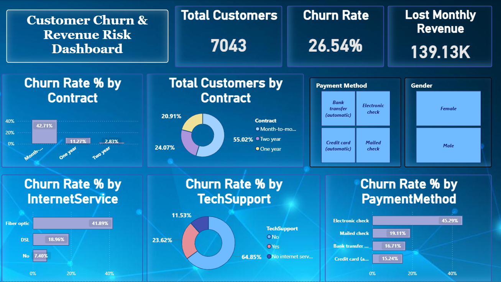
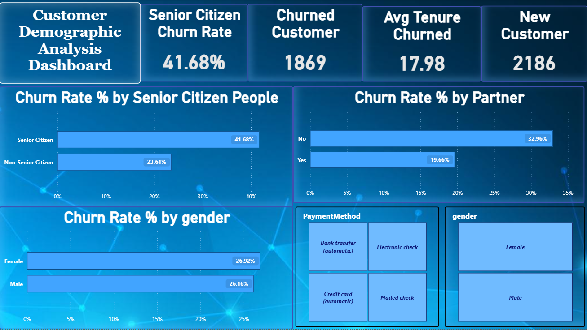

# 📊 Customer Churn & Revenue Risk Dashboard

 📌 Project Overview

This Power BI dashboard analyzes customer churn patterns and revenue risk for a telecommunications company. The dashboard helps identify the major reasons behind customer churn and highlights customer segments that require attention to improve retention.

 🎯 Business Problem

Customer churn leads to revenue loss and increased customer acquisition costs. This dashboard helps stakeholders understand:

- Which contract types have the highest churn
- Which payment methods are associated with higher churn
- Impact of internet service on churn
- Revenue at risk due to customer churn
- Customer distribution across different categories

 🛠 Tools Used

- Power BI Desktop
- Power Query
- DAX
- Excel

📈 Dashboard KPIs

- Total Customers: **7,043**
- Churn Rate: **26.54%**
- Monthly Revenue Lost: **139.13K**

 📷 Dashboard Preview

Page 1

Page 2

 📊 Key Insights

- Month-to-month contracts have the highest churn rate.
- Electronic check customers show the highest churn among payment methods.
- Fiber optic internet users have a higher churn rate than DSL users.
- Customers without technical support are more likely to churn.
- Approximately 26.5% of customers have churned, resulting in significant revenue loss.

 📁 Repository Contents

- Customer_Churn_Dashboard.pbix
- Dashboard_Page1.png
- Dashboard_Page2.png

💼 Skills Demonstrated

- Data Cleaning
- Data Modeling
- DAX Measures
- Power Query
- Data Visualization
- KPI Reporting
- Business Intelligence

## 👩‍💻 Author

**Shruti Sharma**
🔗 LinkedIn: www.linkedin.com/in/shrutisharma068

Aspiring Data Analyst skilled in SQL, Power BI, Excel, Python, and Machine Learning.
